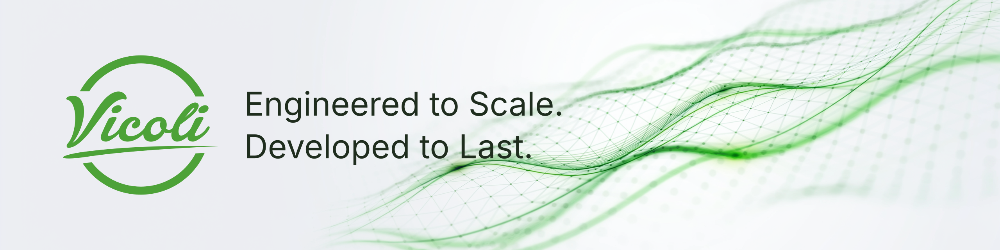

<picture>
  <source media="(prefers-color-scheme: dark)" srcset="banner-dark.png">
  <source media="(prefers-color-scheme: light)" srcset="banner-light.png">
  
</picture>

Vicoli is an independent, Munich-based web development consultancy. For over 20 years, we have built scalable web applications and software platforms for clients ranging from startups to corporations. We pair modern engineering with clear design to create software that reduces complexity and is built for the long term.

## What we do

- **Web-based applications:** custom web software, from CMS solutions to complex platforms.
- **Mobile apps:** mobile and hybrid applications.
- **WebOps & DevOps:** hosting, deployment and operations for the software we build.
- **Digital product development:** taking digital products and in-house solutions from idea to launch.

## Selected work

- **Live streaming platform:** international online events with real-time chat, polls and audience interaction.
- **Interactive digital signage:** a trade-show app with light control and 3D animations.
- **Subscription service:** paid memberships with secure payments for an online publisher.

More projects at [vicoli.de/projects](https://vicoli.de/projects).

## Tech we work with

TypeScript · Vue.js · Nuxt · React · React Native / Expo · Node.js · Tailwind CSS · PostgreSQL · PHP · Docker · Cloudflare Workers · Vitest / Playwright

## Get in touch

Learn more at [vicoli.de](https://vicoli.de) or start a project through the [contact form](https://vicoli.de/contact).

---

Vicoli GmbH · Munich, Germany · [Impressum / Site notice](https://vicoli.de/legal/site-notice)
